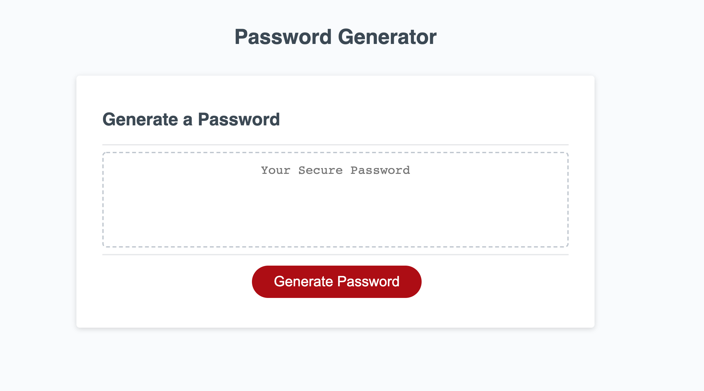

# Description

For this application the objective was to generate a random password based on some user input. 

User Input
- Length of password between 8 and 128 characters.
- Type of characters the user wants included: special characters, numbers, uppercase, and lower case.

Validation: Points of validation were to ensure 
- The user inputs a number between 8 and 128
- user input is nothing other than a numeric value
- user chooses at least one character type

# Link to Application

https://jasandper.github.io/Password-Generator/

# Screenshot

